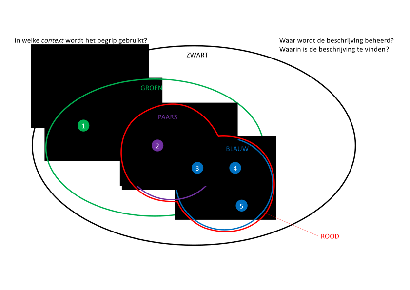

# Context versus Gegevens

Als voorbeeld hebben we 5 begrippen:

Met betrekking tot beheer:

- De beschrijving van begrip 1 is onderdeel van GROEN;
- De beschrijving van begrip 2 is onderdeel van PAARS;
- De beschrijving van begrip 3, 4 en 5 is onderdeel van BLAUW;
- ROOD bestaat uit de beschrijvingen van BLAUW en GROEN.

Met betrekking tot context:

- De contexten van PAARS, BLAUW, GROEN vallen binnen de context van ZWART: alle begrippen worden gebruikt in de context van ZWART;
- Begrippen 1, 2, 3 en 4 worden gebruikt in de context van GROEN;
- Begrippen 2 en 3 worden gebruikt in de context van PAARS;
- Begrippen 3, 4 en 5 worden gebruikt in de context van BLAUW.

Dit leidt tot het volgende figuur. De bolletjes met een nummer geven begrippen aan. De kleur van het bolletje geeft waar de beschrijving is opgenomen, de plek van het bolletje geeft aan tot welke context het bolletje behoord (conform een venn-diagram).



Door beschrijvingen op te nemen in een GRAPH kunnen we dit voorbeeld uitwerken in het volgende trig bestand. Hierbij maken we gebruik van **punning**: voor het geheel van begripsbeschrijvingen en de aanduiding van context gebruiken we dezelfde URI.

```
PREFIX : <http://example.org/>
PREFIX owl: <http://www.w3.org/2002/07/owl#>
PREFIX skos: <http://www.w3.org/2004/02/skos/core#>

GRAPH :zwart {
  :zwart a owl:Ontology, skos:ConceptScheme.
}
GRAPH :groen {
  :groen a owl:Ontology, skos:ConceptScheme;
    skos:inScheme :zwart;         #De context GROEN valt binnen de context ZWART
  .
  :b1 a skos:Concept;
    skos:inScheme :groen;         #Gebruikt in context GROEN
    rdfs:isDefinedBy :groen;      #Gedefinieerd in GROEN
  .
}
GRAPH :blauw {
  :blauw a owl:Ontology, skos:ConceptScheme;
    skos:inScheme :zwart;         #De context BLAUW valt binnen de context ZWART
  .
  :b3 a skos:Concept;
    skos:inScheme :blauw, :groen; #Gebruikt in context BLAUW en GROEN
    rdfs:isDefinedBy :blauw       #Gedefinieerd in BLAUW
  .
  :b4 a skos:Concept;
    skos:inScheme :blauw, :groen; #Gebruikt in context BLAUW en GROEN
    rdfs:isDefinedBy :blauw       #Gedefinieerd in BLAUW
  .
  :b5 a skos:Concept;
    skos:inScheme :blauw;         #Gebruikt in context BLAUW
    rdfs:isDefinedBy :blauw       #Gedefinieerd in BLAUW
  .
}
GRAPH :paars {
  :paars a owl:Ontology, skos:ConceptScheme;
    skos:inScheme :zwart;         #De context PAARS valt binnen de context ZWART
    owl:imports :blauw;           #Beschrijvingen uit BLAUW zijn opgenomen in PAARS
  .
  :b2 a skos:Concept;
    skos:inScheme :paars, :groen; #Gebruikt in context PAARS en GROEN
    rdfs:isDefinedBy :paars       #Gedefinieerd in PAARS
  .
  :b3 skos:inScheme :paars.       #Gebruikt in context PAARS
}
GRAPH :rood {
  :rood a owl:Ontology;
    owl:imports :paars, :blauw    #Beschrijving uit PAARS en BLAUW zijn opgenomen in ROOD
  .
}
```

We stellen voor dat:
- ROOD, BLAUW, GROEN, PAARS en ZWART zijn informatie-objecten: taalbinding *informatie-object* -> `owl:Ontolgy`;
- ZWART, BLAUW, GROEN en PAARS zijn begrippenkaders: taalbinding *begrippenkader* -> `skos:ConceptScheme` EN `owl:Ontology`
- ZWART, BLAUW, GROEN en PAARS zijn begrippenstelsels: taalbinding *begrippenstelsel* -> `skos:ConceptScheme`;
- De begrippen 2 en 3 maken onderdeel uit van het *begrippenstelsel* PAARS;
- De begrippen 3, 4 en 5 maken onderdeel uit van het *begrippenstelsel* BLAUW;
- De beschrijving van begrip 2 maakt onderdeel uit van het *begrippenkader* PAARS;
- De beschrijvingen van begrippen 3, 4 en 5 maakt onderdeel uit van het *begrippenkader* BLAUW.

Dit onderscheid is consistent met [SKOS reference, section 4.6.1](https://www.w3.org/TR/2009/REC-skos-reference-20090818/#L1101). SKOS maakt onderscheid tussen *Closed* en *Open* systems. Daarbij geldt dat een skos:ConceptScheme een *open* system is: je kunt niet beperken welke begrippen er wel of niet onderdeel van uitmaken.

Het onderscheid is sterker zichtbaar als we **punning** loslaten en ook invulling geven aan versies. Dit is uitgewerkt in onderstaand trig bestand:

```
PREFIX : <http://example.org/>
PREFIX owl: <http://www.w3.org/2002/07/owl#>
PREFIX skos: <http://www.w3.org/2004/02/skos/core#>
PREFIX dct: <http://purl.org/dc/terms/>

GRAPH :zwart-v1 {
  :zwart a owl:Ontology, skos:ConceptScheme.
  :zwart-v1 a owl:Ontology;
    dct:isVersionOf :zwart
  .
}
GRAPH :groen-v1 {
  :groen a owl:Ontology, skos:ConceptScheme;
    skos:inScheme :zwart;         #De context GROEN valt binnen de context ZWART
  .
  :groen-v1 a owl:Ontology;
    dct:isVersionOf :groen
  .
  :b1 a skos:Concept;
    skos:inScheme :groen;         #Gebruikt in context GROEN
    rdfs:isDefinedBy :groen-v1;   #Gedefinieerd in versie 1 van GROEN
  .
}
GRAPH :blauw-v1 {
  :blauw a owl:Ontology, skos:ConceptScheme;
    skos:inScheme :zwart;         #De context BLAUW valt binnen de context ZWART
  .
  :blauw-v1 a owl:Ontology;
    dct:isVersionOf :blauw
  .
  :b3 a skos:Concept;
    skos:inScheme :blauw, :groen; #Gebruikt in context BLAUW en GROEN
    rdfs:isDefinedBy :blauw-v1    #Gedefinieerd in versie 1 van BLAUW
  .
  :b4 a skos:Concept;
    skos:inScheme :blauw, :groen; #Gebruikt in context BLAUW en GROEN
    rdfs:isDefinedBy :blauw-v1    #Gedefinieerd in versie 1 van BLAUW
  .
  :b5 a skos:Concept;
    skos:inScheme :blauw;         #Gebruikt in context BLAUW
    rdfs:isDefinedBy :blauw-v1    #Gedefinieerd in versie 1 van BLAUW
  .
}
GRAPH :paars-v1 {
  :paars a owl:Ontology, skos:ConceptScheme;
    skos:inScheme :zwart;         #De context PAARS valt binnen de context ZWART
  .
  :paars-v1 a owl:Ontology;
    dct:isVersionof :paars;
    owl:imports :blauw-v1         #Beschrijvingen uit versie 1 van BLAUW zijn opgenomen in versie 1 van PAARS
  .
  :b2 a skos:Concept;
    skos:inScheme :paars, :groen; #Gebruikt in context PAARS en GROEN
    rdfs:isDefinedBy :paars-v1    #Gedefinieerd in versie 1 van PAARS
  .
  :b3 skos:inScheme :paars.       #Gebruikt in context PAARS
}
GRAPH :rood-v1 {
  :rood a owl:Ontology.
  :rood-v1 a owl:Ontology;
    dct:isVerionOf :rood;
    owl:imports :paars-v1, :blauw-v1    #Beschrijving uit versie 1 van PAARS en versie 1 van BLAUW zijn opgenomen in versie 1 van ROOD
  .
}
```
